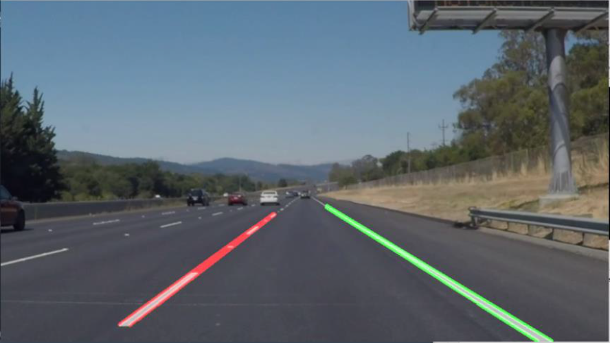
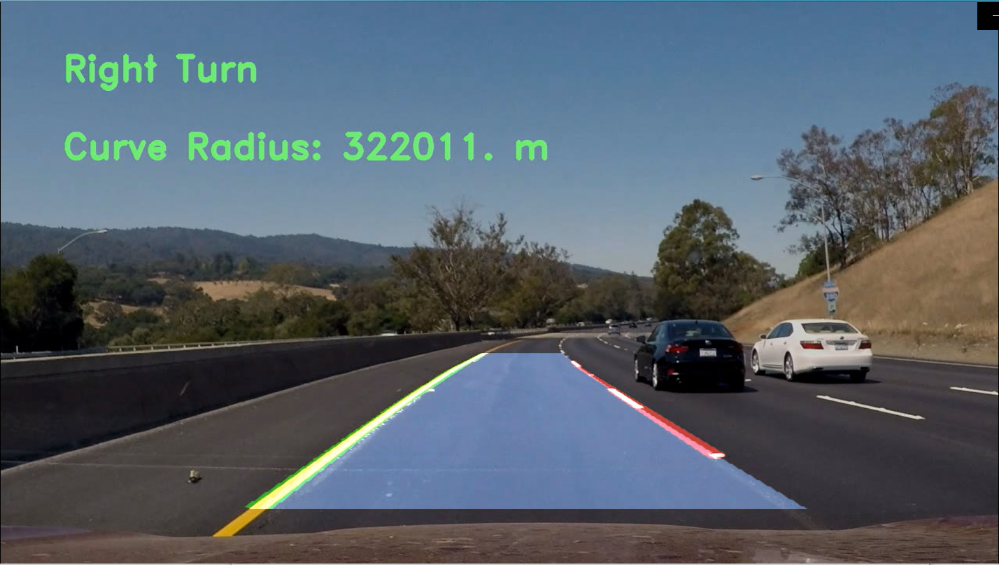

# Advanced Lane Detection

The goal of the project is to build a lane detection pipeline for a ground vehicle. This project was done as part of an assignment for  the following course - ENPM673, Perception for Autonomous Robots.

The two python files perform the following tasks:
- Problem2.py - detect and distinguish dashed lanes from solid lanes
- Problem3.py - predict curvature of the road in front
 
[Q2_StraightLine.mp4](https://github.com/jaisharma10/Lane-Detection/blob/main/Q2_StraightLine.mp4) and [Q3_PredictTurn.mp4](https://github.com/jaisharma10/Lane-Detection/blob/main/Q3_PredictTurn.mp4) are the original videos that we work on. Ensure that the two media files are in the same folder as the python scripts are in.

## Perception Algorithm Pipeline

#### Lane Detection: 

1. Perform CannyEdge Method
2. Apply Region of Interest Mask
3. Use Hough Transform to detect all Lines
4. Lane Segmentation Algorithm

#### Turn Prediction:

1. Preprocess the image using HSV masks for yellow and white
2. Perform CannyEdge Method
3. Use Hough Transform to detect all Lines
4. Apply a perspective transform to attain a "birds-eye view".
5. Detect lane pixels on warped image and fit it to locate the lanes.
6. Us np.polyfit() to get equation of line of the two lanes.
7. Implement an algorithm to calculate radius of curvature.
8. Unwarp the image and display curvature radius and predicted direction on playing video.

A more detailed explanation of my work is written in the following [report](https://github.com/jaisharma10/Lane-Detection/blob/main/Project_2_Report.pdf).

## Results

#### Lane Detection: 

  

  

#### Turn Prediction:

  

  
The final video output for the two python files can be found on this Google Drive [link](https://drive.google.com/drive/folders/1T96PgZn_4gbJAW50hzEo7YZnGQKx-IC9?usp=sharing)

## Support
For any questions, email me at jaisharm@umd.edu
